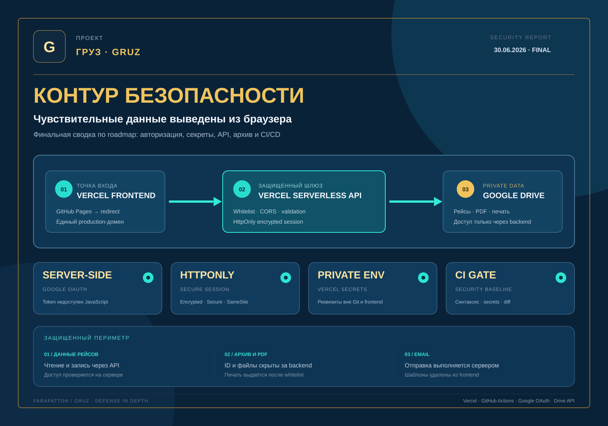

# GRUZ

**Автоматизация грузоперевозок, документооборота, архива и управленческой аналитики**

[Открыть приложение](https://gruz-kappa.vercel.app) · [Security roadmap](docs/security-roadmap.md) · [Архитектура backend](docs/vercel-backend.md)

Трансформация локального бизнеса в прозрачную управляемую систему. Проект заменяет ручные операции алгоритмами, снижает влияние человеческого фактора и объединяет ключевые процессы грузоперевозок в одном интерфейсе.

## Финальная сводка по безопасности

Основной production-контур размещён на Vercel. Google OAuth работает через серверную зашифрованную сессию, чувствительная конфигурация хранится в Vercel Environment Variables, а операции с рейсами, архивом, PDF, печатью и email проходят через защищённые serverless API. Старый адрес GitHub Pages используется только для перенаправления на основной домен.

> Безопасность рассматривается как непрерывный процесс. За пределами завершённого базового контура остаются плановое сужение Google OAuth scopes и добавление минимального backend audit log без лишних персональных данных.
